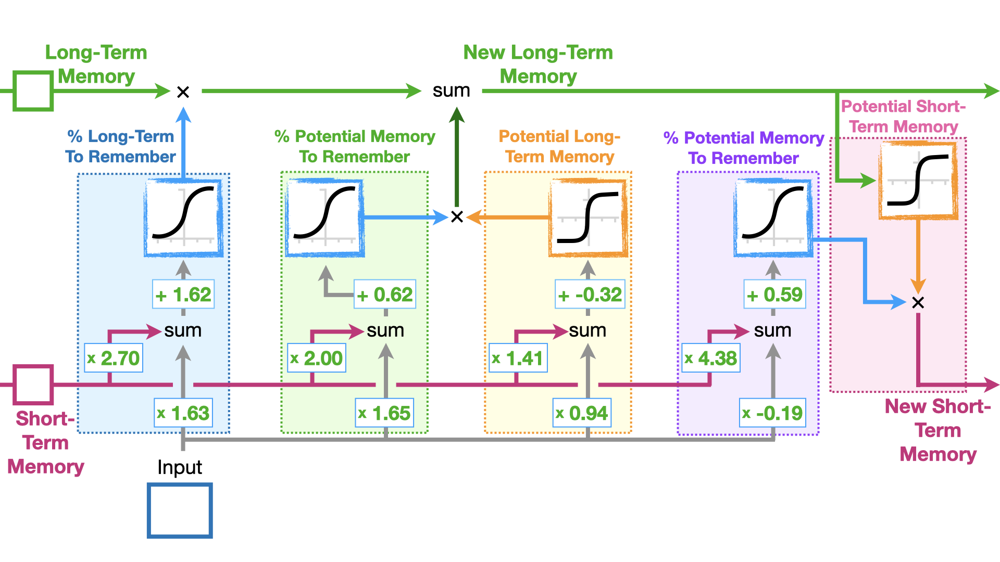

# CSYE7374_LLMOps

### Deep Neural Network (DNN)

#### 1. Forward Pass  
Input layer:  
`z1 = w11 * x1 + w21 * x2 + b1`  
`h1 = ReLU(z1)`  

`z2 = w12 * x1 + w22 * x2 + b2`  
`h2 = ReLU(z2)`  

Output layer (sigmoid activation):  
`z_out = v1 * h1 + v2 * h2 + b_out`  
`ŷ = 1 / (1 + exp(-z_out))`  

#### 2. Loss Function (Binary Cross-Entropy)  
`Loss = - ( y * log(ŷ) + (1 - y) * log(1 - ŷ) )`  

#### 3. Backward Pass + Gradient Descent  
Each parameter θ (weights and biases) is updated as:  

`θ = θ - α * ∂Loss / ∂θ`  

Examples:  
- `w11 = w11 - α * ∂Loss / ∂w11`  
- `w21 = w21 - α * ∂Loss / ∂w21`  
- `v1 = v1 - α * ∂Loss / ∂v1`  
- `b_out = b_out - α * ∂Loss / ∂b_out`  

####  Summary
1. Forward Pass → compute prediction `ŷ`  
2. Loss → measure difference between prediction and true label `y`  
3. Backward Pass → compute gradients  
4. Gradient Descent → update all weights and biases to reduce loss  

### Recurrent Neural Network (RNN)

#### 1. Forward Pass  
At each time step `t`, the RNN takes the current input `x_t` and the previous hidden state `h_{t-1}`:  

Hidden state update:  
`a_t = W_x * x_t + W_h * h_{t-1} + b`  

- `x_t` → the input at step t (e.g., the current word or number)  
- `W_x` → weight matrix that scales the current input  
- `h_{t-1}` → hidden state from the previous time step (the "memory")  
- `W_h` → weight matrix that controls how much past memory influences the current step  
- `b` → bias term, shifts the result  

Activation:  
`h_t = tanh(a_t)`  

- `tanh()` → squashes values into (-1, 1), introduces nonlinearity, and keeps hidden state stable  
- `h_t` → updated hidden state (combines current input and past context)  

Output at time t:  
`y_t = W_y * h_t + c`  

- `W_y` → weight mapping hidden state to output  
- `c` → output bias  
- `y_t` → model’s prediction at step t  

👉 Key difference from DNN:  
- DNN only looks at input `x`  
- RNN uses both `x_t` and the memory `h_{t-1}`, so it can "remember" context from earlier steps.  

#### 2. Loss Function (Sequence MSE example)  
For a sequence of length T, with target outputs `y*_t`:  

`Loss = Σ ( 0.5 * (y_t - y*_t)^2 )` for `t = 1...T`

#### 3. Backward Pass (Backpropagation Through Time, BPTT)  
- Compute gradient at each step t:  
  `δa_t = (∂Loss/∂y_t * W_y + δa_{t+1} * W_h) * (1 - h_t^2)`  

- Use these to calculate parameter gradients:  
  - `∇W_x = Σ δa_t * x_t`  
  - `∇W_h = Σ δa_t * h_{t-1}`  
  - `∇W_y = Σ h_t * (y_t - y*_t)`  
  - `∇b  = Σ δa_t`  
  - `∇c  = Σ (y_t - y*_t)`  

#### 4. Gradient Descent Updates  
Each parameter θ (weights and biases) is updated as:  

`θ = θ - α * ∂Loss / ∂θ`  

Examples:  
- `W_x = W_x - α * ∇W_x`  
- `W_h = W_h - α * ∇W_h`  
- `W_y = W_y - α * ∇W_y`  
- `b   = b   - α * ∇b`  
- `c   = c   - α * ∇c`  

#### ✅ Example (Sequence [1,2,3] → Predict [2,3,4])  

- **Initialization**
  - Inputs: `x = [1, 2, 3]`
  - Initial hidden state: `h0 = 0`
  - Parameters: `W_x = 0.6`, `W_h = 0.5`, `W_y = 1.0`, `b = 0`, `c = 0`
  - Update/Output rules:
    - `a_t = W_x * x_t + W_h * h_{t-1} + b`
    - `h_t = tanh(a_t)`
    - `y_t = W_y * h_t + c`

- **Step-by-step (initial forward pass)**  

  - t=1:  
    `a1 = W_x * x1 + W_h * h0 + b = 0.6*1 + 0.5*0 + 0 = 0.6`  
    `h1 = tanh(a1) = tanh(0.6) ≈ 0.537`  
    `y1 = W_y * h1 + c = 1.0*0.537 + 0 = 0.537 ≈ 0.54`  

  - t=2:  
    `a2 = W_x * x2 + W_h * h1 + b = 0.6*2 + 0.5*0.537 + 0 = 1.4685`  
    `h2 = tanh(a2) = tanh(1.4685) ≈ 0.899`  
    `y2 = W_y * h2 + c = 1.0*0.899 + 0 = 0.899 ≈ 0.90`  

  - t=3:  
    `a3 = W_x * x3 + W_h * h2 + b = 0.6*3 + 0.5*0.899 + 0 = 2.2497`  
    `h3 = tanh(a3) = tanh(2.2497) ≈ 0.978`  
    `y3 = W_y * h3 + c = 1.0*0.978 + 0 = 0.978 ≈ 0.98`  

- Initial predictions: `[0.54, 0.90, 0.98]` (far from targets)  
- After 1 update: `[1.86, 2.19, 2.22]` (loss dropped from **7.84 → 1.93**)  
- After 10 updates: `[2.12, 3.13, 3.44]` (loss ≈ **0.17**)  

| Epoch | Predictions (y1, y2, y3)      | Loss   |
|-------|-------------------------------|--------|
| 0     | [0.54, 0.90, 0.98]            | 7.84   |
| 1     | [1.86, 2.19, 2.22]            | 1.93   |
| 2     | [1.95, 2.63, 2.71]            | 0.95   |
| 3     | [2.05, 2.85, 3.00]            | 0.52   |
| 4     | [2.08, 2.98, 3.18]            | 0.36   |
| 5     | [2.12, 3.06, 3.28]            | 0.27   |
| 6     | [2.16, 3.11, 3.35]            | 0.22   |
| 7     | [2.19, 3.14, 3.39]            | 0.19   |
| 8     | [2.23, 3.12, 3.32]            | 0.26   |
| 9     | [2.16, 3.12, 3.38]            | 0.21   |
| 10    | [2.12, 3.13, 3.44]            | 0.17   |

👉 RNN gradually learned the sequence rule (`next number = +1`) by **remembering past inputs via hidden states**.

####  RNN Parameters Cheat Sheet

| Parameter | Controls | ↑ Increase | ↓ Decrease |
|-----------|----------|------------|------------|
| **W_x** (input weights) | Impact of current input `x_t` | Focus more on current input | Rely more on past state |
| **W_h** (recurrent weights) | Impact of past state `h_{t-1}` | Stronger memory, long-term context | Weaker memory, short-term focus (like DNN) |
| **W_y** (output weights) | Map hidden state `h_t` → output `y_t` | Stronger, sharper outputs | Softer, less confident outputs |
| **b** (hidden bias) | Hidden state baseline | Easier to activate | Harder to activate |
| **c** (output bias) | Output baseline | Outputs shift higher | Outputs shift lower |

### Long Short-Term Memory (LSTM)

#### 1. Forward Pass  
At each time step `t`, the LSTM takes the current input `x_t`, the previous short-term memory (hidden state) `h_{t-1}`, and the previous long-term memory (cell state) `C_{t-1}`.

**(a) Forget Gate `f_t` – Blue (% Long-Term To Remember)**  
`f_t = σ(W_fh * h_{t-1} + W_fx * x_t + b_f)`  

- Decides how much of the old long-term memory to keep  
- `σ` → sigmoid function, outputs between (0,1)  
- If `f_t ≈ 1` → keep most of `C_{t-1}`  
- If `f_t ≈ 0` → forget most of `C_{t-1}`  

- `x_t` → current input at time step t  
- `h_{t-1}` → previous short-term memory (hidden state)  
- `C_{t-1}` → previous long-term memory (cell state)  
- `f_t` → forget gate output (blue), decides how much of the old memory to keep

**(b) Input Gate `i_t` + Candidate Memory `C_t_candidate` – Green + Yellow**  
`i_t = σ(W_ih * h_{t-1} + W_ix * x_t + b_i)`  
`C_t_candidate = tanh(W_Ch * h_{t-1} + W_Cx * x_t + b_C)`  

- Input Gate (green) controls **how much new information enters**  
- Candidate Memory (yellow, via tanh) generates potential new content that could be added to the long-term memory  
- The product `i_t * C_t_candidate` determines **how much of this new content is actually written into** the long-term memory  
- If `i_t ≈ 1` → almost all of the candidate memory is written into `C_t`  
- If `i_t ≈ 0` → almost none of the candidate memory is written into `C_t`  

- `i_t` → input gate output (green), proportion of new info to be added  
- `C_t_candidate` → candidate memory (yellow), proposed new content generated from input and previous STM  

**(c) Cell State Update `C_t` – Combination (Yellow + Green + Blue)**  
`C_t = f_t * C_{t-1} + i_t * C_t_candidate`  

- Combines **forgotten old memory** (blue, controlled by `f_t`) and **new candidate memory** (green + yellow, controlled by `i_t`)  
- This produces the updated **long-term memory** `C_t`  

- If `f_t` is high and `i_t` is low → mostly keep old memory, little new info added  
- If `f_t` is low and `i_t` is high → mostly forget old memory, replace with new info  
- If both `f_t` and `i_t` are high → keep old memory and add new info → memory grows richer  
- If both are low → forget old memory and add little new info → memory shrinks  

- `C_t` → new long-term memory (cell state)  
- `f_t * C_{t-1}` → retained portion of old memory  
- `i_t * C_t_candidate` → newly added memory content  

**(d) Output Gate `o_t` and New Short-Term Memory `h_t` – Purple + Pink**  
`o_t = σ(W_oh * h_{t-1} + W_ox * x_t + b_o)`  
`h_t = o_t * tanh(C_t)`  

- Output Gate (purple) decides **how much of the updated long-term memory is revealed** as short-term memory  
- The product `o_t * tanh(C_t)` becomes the new short-term memory `h_t` (pink)  
- If `o_t ≈ 1` → almost all of the processed long-term memory is passed out as `h_t`  
- If `o_t ≈ 0` → very little is passed out, `h_t` stays close to 0  

- `o_t` → output gate output (purple), controls how much of the memory is revealed  
- `h_t` → new short-term memory / hidden state (pink), final output at step t  

#### 2. Loss Function (Sequence Example with MSE)  
For a sequence of length T, with targets `y*_t`:  

`y_t = W_y * h_t + c`  

`Loss = Σ ( 0.5 * (y_t - y*_t)^2 )` for `t = 1...T`

#### 3. Backward Pass (Backpropagation Through Time with Gates)  
- Compute gradients through each gate (chain rule):  
  - `δf_t, δi_t, δo_t, δC_t_candidate`  
- Update parameter gradients:  
  - `∇W_f, ∇W_i, ∇W_o, ∇W_C`  
  - `∇b_f, ∇b_i, ∇b_o, ∇b_C`  
- Update output layer gradients:  
  - `∇W_y, ∇c`  

> Note: The prediction layer `y_t = W_y * h_t + c` is outside the LSTM core.  
> Its gradients flow back into `h_t`, and then further into the gates and cell state.

#### 4. Gradient Descent Updates  
Each parameter θ is updated as:  

`θ = θ - α * ∂Loss / ∂θ`  

Examples:  
- `W_f = W_f - α * ∇W_f`  
- `W_i = W_i - α * ∇W_i`  
- `W_C = W_C - α * ∇W_C`  
- `W_o = W_o - α * ∇W_o`  
- `W_y = W_y - α * ∇W_y`  
- Biases updated similarly: `b_f, b_i, b_C, b_o, c`  

#### ✅ Example (Tiny Walkthrough)  
Suppose:  
- Input at step t: `x_t = 1`  
- Short-term memory: `h_{t-1} = 1`  
- Long-term memory: `C_{t-1} = 2`  
- Forget Gate formula (from diagram): `f_t = σ(2.70*h + 1.63*x + 1.62)`  

**Step**  
- Forget Gate: `f_t ≈ 0.997` → keep ~99.7% of `C_{t-1}`  
- Input Gate + Candidate: add controlled new info via `i_t * C_t_candidate`  
- Cell State: `C_t = f_t * 2 + i_t * C_t_candidate` ≈ 1.99 + extra new info  
- Output Gate: `h_t = o_t * tanh(C_t)` → produces new short-term memory  

👉 Result: LSTM preserves old memory (because Forget Gate is high) but also integrates new input. 

#### Effect of Previous STM and LTM on New LTM and STM

| Case | Previous STM (`h_{t-1}`) | Previous LTM (`C_{t-1}`) | Effect on Gates | New LTM (`C_t`) | New STM (`h_t`) |
|------|--------------------------|--------------------------|-----------------|-----------------|-----------------|
| ① Strong STM, Strong LTM | Large | Large | Forget Gate `f_t` ↑, Input Gate `i_t` ↑, Output Gate `o_t` ↑ | Old memory largely kept + new info added → `C_t` big | Output Gate wide open + big `C_t` → `h_t` big |
| ② Strong STM, Weak LTM | Large | Small | Forget Gate `f_t` ↑, Input Gate `i_t` ↑ | New info written in strongly → `C_t` grows | Output Gate wide open but `C_t` small → `h_t` moderate |
| ③ Weak STM, Strong LTM | Small | Large | Forget Gate `f_t` ↓, Input Gate `i_t` ↓, Output Gate `o_t` ↓ | Old memory partially forgotten, little new info added → `C_t` shrinks | Output Gate more closed → `h_t` small |
| ④ Weak STM, Weak LTM | Small | Small | Gates less active overall | Very little old memory kept, little new info added → `C_t` remains small | `o_t` small and `C_t` small → `h_t` very small |

#### LSTM Parameters Cheat Sheet  

| Parameter | Controls | ↑ Increase | ↓ Decrease |
|-----------|----------|------------|------------|
| **W_f** (forget weights, blue) | How much old memory to keep | Less forgetting | More forgetting |
| **W_i** (input weights, green) | How much new info to add | More update from input | Less new info written |
| **W_C** (candidate weights, yellow) | What the new memory looks like | Stronger candidate content | Weaker candidate content |
| **W_o** (output weights, purple) | How much memory goes to output | Stronger hidden signal | Weaker hidden signal |
| **b_f, b_i, b_C, b_o** | Bias shifts each gate | Easier/harder to activate gates | — |

### Cross-Entropy (CE)

#### 1. Setup (Softmax multi-class)
The model outputs class logits `z = [z_1, ..., z_K]`, then applies softmax to get probabilities.

**(a) Softmax probabilities `p_k`**  
`p_k = exp(z_k) / Σ_j exp(z_j)`

- Maps each `z_k` to `(0, 1)` and ensures `Σ_k p_k = 1`
- `p_k` is the predicted probability of class `k`

- `z_k` → unnormalized score (logit) for class `k`  
- `p_k` → softmax probability for class `k`  
- `K`   → number of classes

**(b) Cross-Entropy loss `CE` (true class `y`)**  
`CE = -log(p_y)`

- Uses only the probability of the **true class**  
- If `p_y ≈ 1` → `CE` small (confident & correct)  
- If `p_y ≈ 0` → `CE` large (wrong or uncertain)  
- `log` is the natural logarithm

- `y`   → index of the true class  
- `p_y` → softmax probability assigned to the true class  
- `CE`  → loss for the current sample

**(c) Batch / sequence aggregation**  
`CE_batch = (1/N) * Σ_n [ -log( p^{(n)}_{ y^{(n)} } ) ]`  

- `p^{(n)}_{y^{(n)}}` is `p^{(n)}`, take the `y^{(n)}`-th component (the probability assigned to the true class).  
  Example: `p^(1) = [0.70, 0.20, 0.10], y^(1) = 1  →  y^(1)-th component = the 1st element = 0.70 = p^(1)_{y^(1)}`

#### ✅ Simple example (3 classes)

Logits: `[2.0, 0.5, -1.0]`  
- `exp = [7.389, 1.649, 0.368]`, `sum = 9.406`  
- `p = [0.786, 0.175, 0.039]`

- If `y = 1`: `CE = -log(0.786) ≈ 0.241`  
- If `y = 2`: `CE = -log(0.175) ≈ 1.742`  

### Focal Loss (softmax multi-class)

**Per-sample focal loss (true class `y`)**  
`FL = - α_y * (1 - p_y)^γ * log(p_y)`
`CE = -log(p_y)`

- `p_y` → softmax probability assigned to the true class  
- `γ >= 0` → focusing parameter (larger γ down-weights easy samples more)  
- `α_y` → class weight for imbalance (larger for rare classes)  
- Special case: if `γ = 0` and `α_y = 1`, then `FL = CE`
- Increase `γ` → `FL` decreases for all samples, **much more for easy ones** (`p_y` near 1) → training **focus shifts to hard samples**  
- Decrease `γ` → closer to CE; easy samples get **more** relative weight  
- Increase `α_y` → **linearly increases** the loss for class `y` (useful to boost rare classes)  
- Decrease `α_y` → reduces the loss contribution for class `y`  
- Note: overly large `γ` can underfit (loss becomes too small overall); tune on a validation set  

#### ✅ Simple examples

**Easy sample** (very confident correct):  
`p_y = 0.99, γ = 2, α_y = 1`  
`FL = - 1 * (1 - 0.99)^2 * log(0.99) ≈ (0.01)^2 * 0.010 ≈ 0.000001`  (almost zero)

**Hard sample** (uncertain/wrong-leaning):  
`p_y = 0.30, γ = 2, α_y = 1`  
`FL = - 1 * (1 - 0.30)^2 * log(0.30) ≈ 0.49 * 1.204 ≈ 0.590`

**3-class example (reusing earlier logits)**  
Logits: `[2.0, 0.5, -1.0]` → softmax `p ≈ [0.786, 0.175, 0.039]`  

- If `y = 2` (true class prob `p_y = 0.175`), `γ = 2`, `α_y = 1`:  
  `FL = - 1 * (1 - 0.175)^2 * log(0.175) ≈ 0.825^2 * 1.742 ≈ 0.6806 * 1.742 ≈ 1.185`

- If `y = 1` (true class prob `p_y = 0.786`), `γ = 2`, `α_y = 1`:  
  `FL = - 1 * (1 - 0.786)^2 * log(0.786) ≈ 0.214^2 * 0.241 ≈ 0.0458 * 0.241 ≈ 0.0110`

### Weighted Cross-Entropy (softmax multi-class)

**(a) Per-sample loss (true class `y`)**  
`WCE = - w_y * log(p_y)`
`CE = -log(p_y)`

- `p_y` → softmax probability assigned to the true class  
- `w_y` → class weight for the true class (larger for rarer / more important classes)  
- Special case: if `w_y = 1` for all classes, `WCE = CE`  
- Increase `w_y` → linearly increases the loss/gradient for class `y` → the model learns that class **more aggressively**  
- Decrease `w_y` → reduces that class’s contribution

**(b) Batch / sequence aggregation**  
Two common reductions (pick one and be consistent):

- Mean over samples:  
  `WCE_batch = (1/N) * Σ_n [ - w_{y^(n)} * log( p^{(n)}_{ y^{(n)} } ) ]`

- Normalize by sum of weights:  
  `WCE_batch = ( Σ_n w_{y^(n)} * [ -log( p^{(n)}_{ y^{(n)} } ) ] ) / ( Σ_n w_{y^(n)} )`

- `p^{(n)}_{y^{(n)}}` is `p^{(n)}`, take the `y^{(n)}`-th component (the probability of the true class).  
  Example: `p^(1) = [0.70, 0.20, 0.10], y^(1) = 1  →  y^(1)-th component = the 1st element = 0.70 = p^(1)_{y^(1)}`

**(c) Simple example**

Let class weights be `w = [w_1=1.0, w_2=2.0, w_3=1.0]`.  
Reuse logits: `[2.0, 0.5, -1.0]` → softmax `p ≈ [0.786, 0.175, 0.039]`.

- If `y = 2` (true class is 2):  
  `WCE = - w_2 * log(p_2) = - 2.0 * log(0.175) ≈ 2.0 * 1.742 ≈ 3.484`

- If `y = 1` (true class is 1):  
  `WCE = - w_1 * log(p_1) = - 1.0 * log(0.786) ≈ 0.241`

### Reinforcement Learning

#### 1. Q-learning – FrozenLake
Update rule:  
`Q(s_t, a_t) ← Q(s_t, a_t) + α * ( r_t + γ * max_a' Q(s_{t+1}, a') - Q(s_t, a_t) )`

- Learns the optimal value of each action independent of the current policy.  
- Off-policy method.

✅ Example (FrozenLake):  
- State: on start tile  
- Action: "Right"  
- Reward: `r_t = 0` (normal step, not goal yet)  
- Next state's best Q-value: `max Q(s’,·) = 5`  
- Parameters: α = 0.5, γ = 0.9, current Q(s,Right)=0  

Step-by-step:  
`Q(s,Right) ← 0 + 0.5 * ( 0 + 0.9*5 - 0 )`  
`Q(s,Right) = 2.25`  

→ The agent increases its belief that going "Right" is promising because the future leads toward the goal.

#### 2. SARSA – Cliff Walking
Update rule:  
`Q(s_t, a_t) ← Q(s_t, a_t) + α * ( r_t + γ * Q(s_{t+1}, a_{t+1}) - Q(s_t, a_t) )`

- On-policy: uses the actual action taken in the next state.  
- Produces safer policies.

✅ Example (Cliff Walking):  
- State: near cliff edge  
- Action: "Right"  
- Reward: `r_t = -1` (step penalty)  
- Next action chosen: "Right" again, Q(s’,Right)=2  
- Parameters: α=0.5, γ=0.9, current Q(s,Right)=0  

Step-by-step:  
`Q(s,Right) ← 0 + 0.5 * ( -1 + 0.9*2 - 0 )`  
`Q(s,Right) = 0.4`  

→ The update is cautious, reflecting actual path risk instead of assuming the absolute best action.

#### 3. Policy Gradient – CartPole
Update rule (REINFORCE):  
`θ ← θ + α * ∇θ log πθ(a_t|s_t) * R_t`

- Directly adjusts policy probabilities toward actions that yield higher rewards.  
- Works well with continuous states.

✅ Example (CartPole):  
- State: pole leaning slightly right  
- Policy: πθ(Left)=0.5, πθ(Right)=0.5  
- Action: "Right"  
- Reward: balancing longer, `R_t = +10`  
- α = 0.1  

Step-by-step:  
`θ ← θ + 0.1 * ∇θ log(0.5) * 10`  

→ Increases probability of "Right". Next time, the agent is more likely to push right to keep balance.

#### 4. Actor-Critic – MountainCar
Update rules:  
- Critic (value function):  
  `V(s_t) ← V(s_t) + β * ( r_t + γ * V(s_{t+1}) - V(s_t) )`  
- Actor (policy):  
  `θ ← θ + α * ∇θ log πθ(a_t|s_t) * δ`  

where `δ` is the TD error.

✅ Example (MountainCar):  
- State: car stuck in valley  
- Action: "Accelerate Left" (to build momentum)  
- Reward: `r_t = 0` (no immediate success yet)  
- Next state value: V(s’)=3.0, current V(s)=2.0  
- γ=0.9, β=0.5  

TD error:  
`δ = r + γ*V(s’) - V(s) = 0 + 0.9*3 - 2 = 0.7`  

Critic update:  
`V(s) = 2 + 0.5*0.7 = 2.35`  

Actor update:  
Since δ > 0, increase probability of choosing "Accelerate Left".  

→ The agent learns that even though immediate reward is 0, this action helps reach the goal in the long run.

### ✅ Summary
- **Q-learning (FrozenLake):** off-policy, finds optimal values with future best actions.  
- **SARSA (Cliff Walking):** on-policy, safer and more conservative updates.  
- **Policy Gradient (CartPole):** directly improves action probabilities for continuous states.  
- **Actor-Critic (MountainCar):** hybrid method combining value estimates and policy updates.